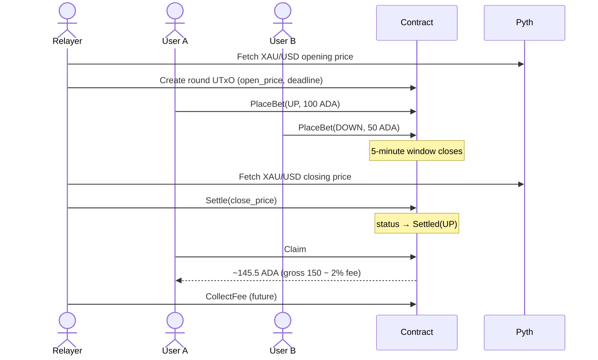
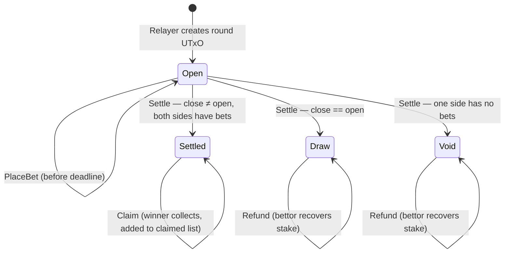

# 5minBets

`5minBets` is a Cardano-native price prediction market written in [Aiken](https://aiken-lang.org). Users bet `UP` or `DOWN` on whether the **gold price in US dollars** (`XAU/USD`) will rise or fall over a fixed 5-minute window, using [Pyth Lazer](https://pyth.network) price data (feed ID `6`) to determine the outcome.

## Status

This repository is currently an early prototype. The product idea and intended round mechanics are described below, but the on-chain implementation in this repo is still minimal and does not yet include the full betting protocol.

## Concept

Each market round follows a simple lifecycle:

1. A relayer opens a round and records the current `XAU/USD` price from Pyth.
2. Users place bets on whether the price will go `UP` or `DOWN` during the next 5 minutes.
3. After the 5-minute window closes, the relayer submits the closing price from Pyth.
4. The contract determines the winning side and enables winners to claim their proportional share of the pool.
5. A 2% protocol fee is deducted before payouts.

### Round lifecycle



### Round states



## Design assumptions

The idea is straightforward, but a production-ready version should make these rules explicit:

- Oracle prices must be verifiable on-chain or otherwise constrained by trusted update logic.
- The relayer must not be able to selectively skip, delay, or manipulate round settlement.
- The market should clearly define what happens in edge cases such as equal open/close prices, no bets on one side, or failed settlement.
- Asset support should be precise. If multiple stablecoins are accepted, the contract must define how they are normalized or separated.

## Current repository state

This repo contains an initial prototype of the betting protocol alongside the original placeholder validator:

```text
.github/
  workflows/
    continuous-integration.yml
validators/
  hello_world.ak          # original placeholder, kept for reference
  round_validator.ak      # prototype betting logic: PlaceBet / Settle / Claim / Refund
lib/
  types.ak                # RoundDatum, RoundStatus, BetSide, Bet, Action
  utils.ak                # pool math, winner determination, payout calculation
env/                      # empty
aiken.toml
aiken.lock                # pins aiken-lang/stdlib v3.0.0 for reproducible builds
plutus.json
.gitignore
README.md
```

The prototype implements the core round mechanics. See **Design assumptions** for what a production version would need to harden.

## Architecture

```text
validators/
  round_validator.ak   # Core betting logic: PlaceBet, Settle, Claim, Refund
lib/
  types.ak             # RoundDatum, RoundStatus, BetSide, Bet, Action
  utils.ak             # Pool math, winner determination, payout calculation
```

### Validator actions

| Action | Who | When | Effect |
|--------|-----|------|--------|
| `PlaceBet` | Any user | Before deadline | Appends bet to datum, locks ADA |
| `Settle` | Relayer | After deadline | Records close price, sets status |
| `Claim` | Winner | After settlement | Pays net payout, marks as claimed |
| `Refund` | Any bettor | Draw or Void | Returns stake, marks as claimed |

A round UTxO is **created** (not validated) when the relayer sends ADA to the script address with an initial `RoundDatum`. No minting policy is required for the prototype.

## Building

Build the current Aiken project with:

```sh
aiken build
```

This produces compiled Plutus artifacts such as `plutus.json`.

## Testing

Run the test suite with:

```sh
aiken check
```

Run only tests matching a string:

```sh
aiken check -m hello
```

## Documentation

Generate HTML documentation with:

```sh
aiken docs
```

## Continuous integration

A GitHub Actions workflow at `.github/workflows/continuous-integration.yml` runs on every push and pull request. It checks formatting (`aiken fmt --check`), runs tests (`aiken check -D`), and builds the project (`aiken build`).

## Resources

- [Aiken user manual](https://aiken-lang.org)
- [Pyth Network on Cardano](https://docs.pyth.network/price-feeds/use-real-time-data/cardano)
- [Cardano developer docs](https://developers.cardano.org)